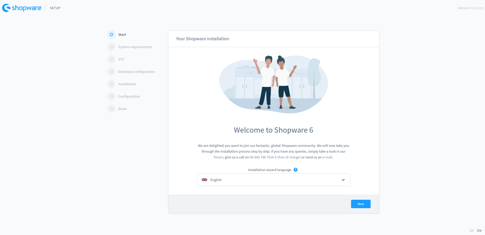
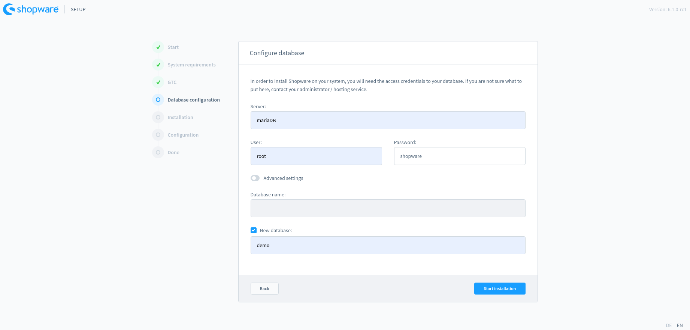
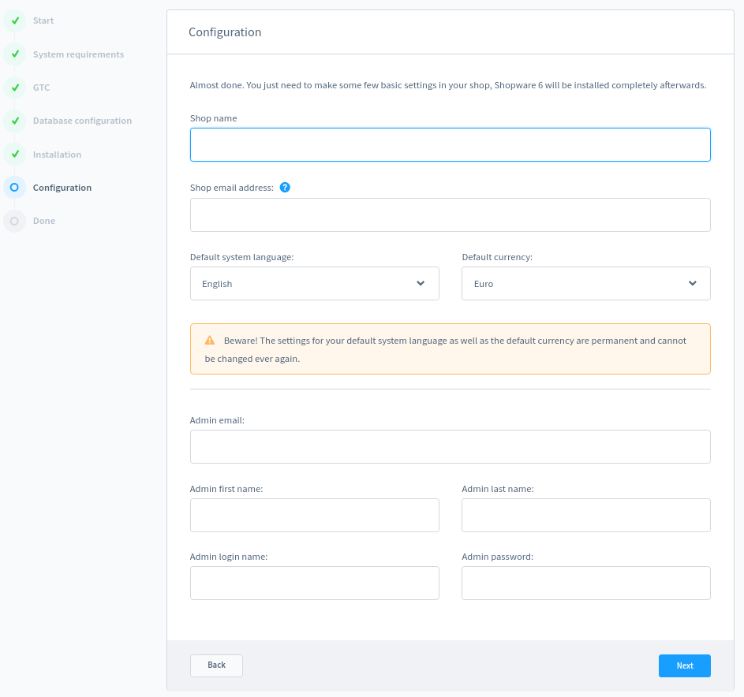
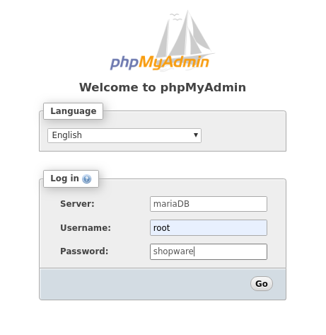

# ShopWare 6 local development environment

This guide will explain the process of installation of SW 6 on docker environment

## Docker

We need to have docker and docker-compose on our PC

We only going to cover the steps for Linux, docker is also available on [Windows](https://docs.docker.com/docker-for-windows/) and [MacOs](https://docs.docker.com/docker-for-mac/)

####  Arch/Manjaro

```shell
sudo pacman -Syu docker docker-compose
```

####  Debian

```shell
sudo apt-get install docker docker-compose
```

We need to be able to run docker as a noon root user, for that we will add our user to the docker group

```shell
sudo usermod -aG docker $USER
```

And we need to log out (*in some cases reboot*)

------

### :rocket: ​Start the docker machine 

We need to clone this repository (in case you did not done that yet). 

Once on the repository folder, we run

```shell
docker-compose up -d
```

This will build and initialize the docker environment

We should now be able to go see the installation process in here:  http://localhost/ :tada:



Now we should be ready proceed with the install.



| Setting            | Value               |
| ------------------ | ------------------- |
| Server:            | mariaDB             |
| User:              | root                |
| Password:          | shopware            |
| - [x] New database | *any_name_you_like* |

Configure the shop



After that you will be promoted to install some languages and some plugins, this is up to you

| Front end         | Back end               |
| ----------------- | ---------------------- |
| http://localhost/ | http://localhost/admin |

### :stop_sign: Stop docker

To stop docker we run

```shell
docker-compose down
```

In case that you need to login into the docker machine

```shell
docker-compose exec web bash
```

Shopware is hosted in `/var/www/html`

## phpMyAdmin

This docker installation also provides [phpMyAdmin](https://www.phpmyadmin.net/) for DB management

```shell
docker-compose up -d #Just to make sure is running
```

and visit http://localhost:8183/



| Setting   | Value    |
| --------- | -------- |
| Server:   | mariaDB  |
| Username: | root     |
| Password: | shopware |


## :bug: ​Known Issues

If you need to begging again

Turn docker off

```shell
docker-compose down
docker stop $(docker ps -aq)
```

Delete all docker containers

```shell
docker rm $(docker ps -aq)
```

Delete all images 

```shell
docker rmi --force $(docker images -q)
```

The database and the code folder might have changed user owner

This will delete those folders

```shell
sudo rm -rf database code
```

